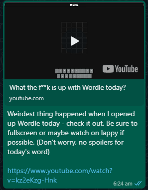
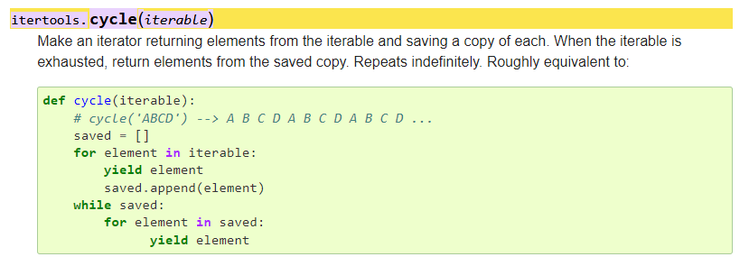

# George's Birthday Wordle

George's Birthday Wordle is a birthday message for my brother George that I created by manipulating the Wordle website with the selenium library in Python.

The following is the message I sent to my brother on the morning of his birthday on 23 Feb 2022. Click anywhere on the message to watch the video (slightly improved from the version originally sent out).

<a href="https://www.youtube.com/watch?v=Vi0Uh2IP2JM"></a>

## How to use it

Those with Python and Google Chrome installed on their computers can run the program as follows:

1. Clone this repo.
2. Get the appropriate version of ChromeDriver for https://chromedriver.chromium.org/downloads and place the chromedriver.exe executable in the root directory.
3. Install the requirements in [requirements.txt](requirements.txt).
```
pip install -r requirements.txt
```
4. Run bday-message.py
```
python bday-message.py
```

## How it works

Since I had decided to use selenium, I did not look at the JavaScript that powers the Wordle game, but I had to work out some aspects of what the JavaScript on the page does through trial and error to get the effect I wanted.

### Writing words to the board

When a letter is written to the board while playing the game for real, it is reflected both in the `letter` attribute of the corresponding `<game-title>` tag and in the inner HTML of its child `div`. Letters written to the inner HTML were either not reflected to the page or were overwritten by the value of the `letter` attribute, so letters are written directly to the `letter` attribute (see the `write_word` and `set_letter` methods of the `WordleController` class in [wordle_controller.py](wordle_controller.py).

### Changing tile colours

Each `<game-tile>` has its own `<style>` tag, so tile colours are changed by overwriting the inner HTML of these tags. I apply tile colours by replacing the value of the `background-color` property under `.tile[data-state='tbd']` so that the new colour will be reflected without needing to change the tile's `data-state` attribute. This is done just after the `flip-in` animation completes (which takes 250ms) to recreate the display in the original game (see the `change_tbd_color` method of the `WordleController` class in [wordle_controller.py](wordle_controller.py)).

### Flipping tiles

Tiles are flipped by setting the `data-animation` attribute of the tile's child `div` to `flip-in` (see the `filp_tile` method of the `WordleController` class in [wordle_controller.py](wordle_controller.py)). 

## New discoveries from this project

I used the itertools cycle function for cycling through the list of 9 colours multiple times in [bday-message.py](bday-message.py). I learnt about this function for the first time while working on this project, but expect to use it again as it is very concise and convenient for this kind of use case.

<a href="https://docs.python.org/3/library/itertools.html#:~:text=itertools.cycle(iterable)"></a>